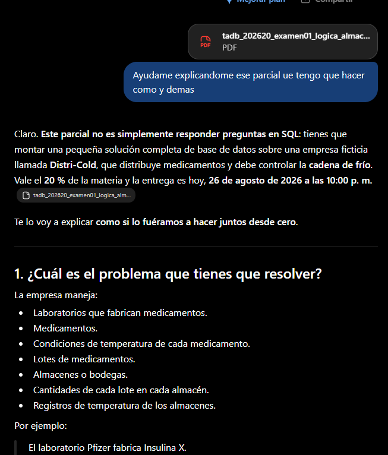
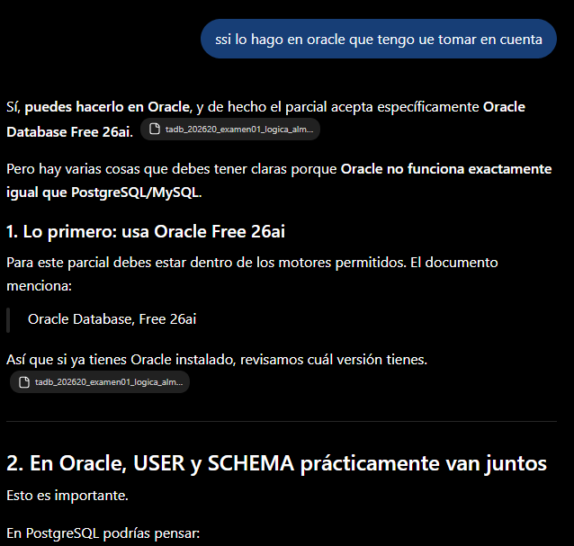
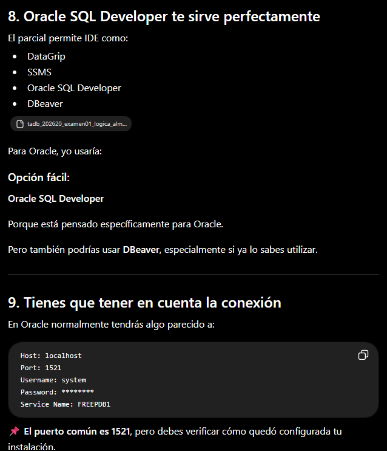
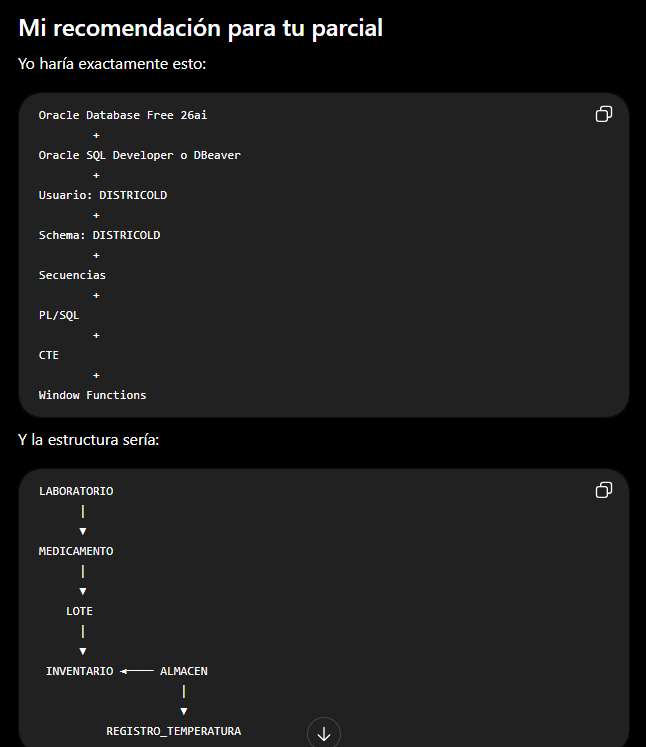

# Registro de interacción con herramienta de IA — Motor Oracle Database Free 26ai

**Integrante:** David Vallejo García — ID SIGAA: 000551513
**Herramienta de IA utilizada:** [completar: nombre exacto de la herramienta y versión/modelo si aplica]

---

## Evidencia cronológica de la conversación

**1) Punto de partida:** se cargó el PDF del enunciado del examen y se pidió una explicación completa de qué había que resolver, el dominio del problema (Distri-Cold, cadena de frío) y la fecha límite de entrega.

**2) Elección del motor:** se preguntó puntualmente qué particularidades tener en cuenta al resolver el examen en Oracle específicamente, en contraste con PostgreSQL/MySQL.

**3) Modelo de seguridad:** se profundizó en por qué no se debe trabajar con el usuario `SYS`/`SYSTEM` para el modelo de aplicación, y cómo crear un usuario propio con los privilegios mínimos necesarios (`CREATE SESSION`, `CREATE TABLE`, `CREATE VIEW`, `CREATE SEQUENCE`, `CREATE PROCEDURE`).

**4) Selección de herramienta de conexión e IDE:** se consultó qué clientes externos son válidos para la Etapa 2 (DataGrip, SSMS, Oracle SQL Developer, DBeaver) y los datos de conexión típicos (host, puerto, Service Name) a tener en cuenta — información que luego se contrastó con el incidente real `ORA-12514` documentado en `01_abastecimiento_conexion_oracle.md`.

**5) Síntesis de la recomendación técnica final:** resumen del stack de la solución (Oracle Database Free 26ai + IDE externo + usuario de aplicación propio + secuencias + PL/SQL + CTE + Window Functions) y del orden de dependencias entre entidades del modelo, que sirvió como punto de partida para diseñar el modelo 3FN definitivo documentado en `README.md`.

## Qué se tradujo de esta conversación a la implementación final

La conversación fue el punto de partida conceptual, pero **no** se copió tal cual — se contrastó y se ajustó contra la documentación oficial de Oracle y contra los errores reales de ejecución, entre ellos:

- El patrón de secuencia sugerido se implementó como `SEQUENCE` + `TRIGGER BEFORE INSERT` explícito por tabla (ver `oracle/sql/02_secuencias_tablas.sql`).
- El error `ORA-01408: such column list already indexed`, no anticipado en la conversación inicial, se depuró de forma independiente revisando qué índices genera Oracle automáticamente al declarar una restricción `UNIQUE` (documentado en `oracle/docs/comandos_carga.md`).
- El error `ORA-12514` de conexión tampoco surgió en la conversación con la IA — se diagnosticó de forma autónoma con `lsnrctl status` dentro del propio contenedor (ver `01_abastecimiento_conexion_oracle.md`).
- La función de la Etapa 5 (`fn_tendencia_temperatura_almacen`, con `SYS_REFCURSOR` y CTEs encadenados de 4 niveles) se diseñó a partir de la pregunta de negocio definida por el equipo, no fue sugerida por la IA en las capturas anteriores.
